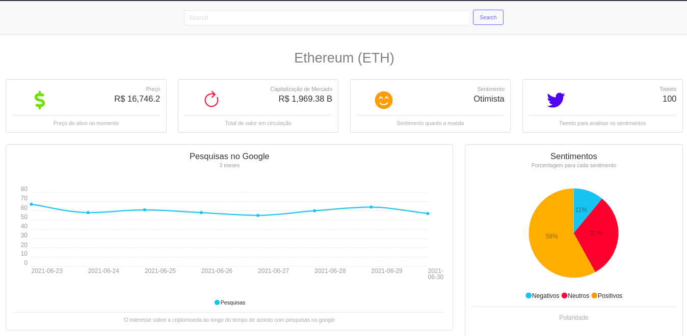

# Cripto Sentiment
Get the criptocoin sentiment with just some clicks

## About
> This is just an MVP site I made to improve my skills with django REST framework and React.js

#### Tech and Librarys
 - Django
 - DjangoRestFramework
 - Docker
 - GithubActions
 - Pytrends
 - Tweepy
 - NLTK
 - CryptoCompare API
 
#### Steps
1. The application will receive a request with the criptocoin name that needs to be analyzed
2. With a valid request it will get 100 tweets related to the coin and use the nltk library to analyze the sentiment of each one
3. After that, it will use a google trends api wrapper (pytrends) to get the amount of times the coin was searched on google in the last 3 months
4. The last thing it will do is get the information about the price, market_cap and the symbol of this coin with the cryptocompare api
------
##### Observations
- > The app will only get the first 10 coins ordered by marketcap and 100 tweets because of api limits (twitterAPI, cryptocompareAPI
- > This repo uses github actions to test and deploy the app (if the tests pass) on heroku
- > I used a [react template](https://www.creative-tim.com/product/light-bootstrap-dashboard-react) by creative-time and edited it
